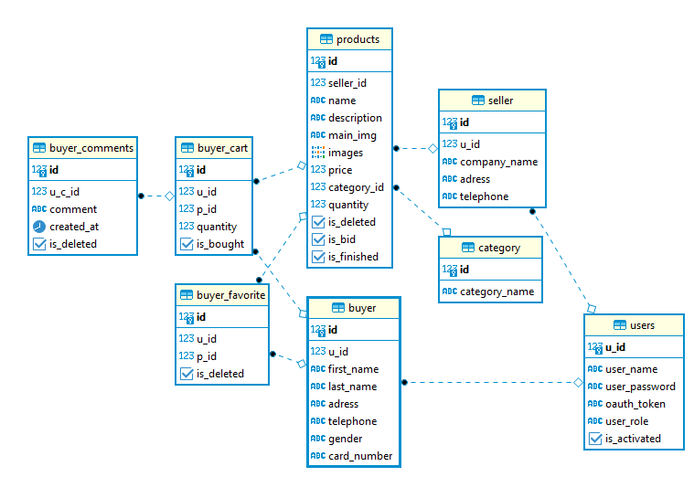
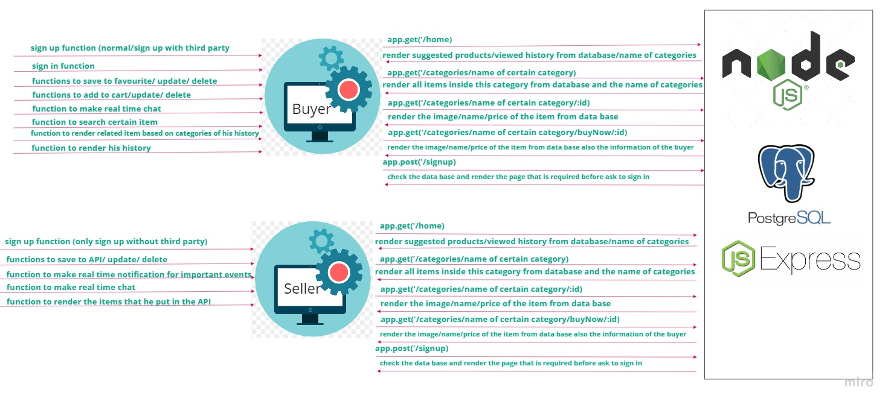

# SportTopia

A marketplace where sellers get all the tools that help them achieve high sales, while buyers have a user-friendly experience that easies communication and search.

This is a market for all sellers and buyers with different categories of items, where you can chat with the seller, leave a message if they are offline, and get recommended items. As for sellers they can track which users viewed their items, chat back with them and offer discounts before users leave.

SAAM TEAM:

- Saif Al-Rawad
- Ahmad Yousef
- Aya Akrabawi
- Malek Hassan

## Entity Relationship Diagram

## Relations:

- users table has a one-to-one relation with the seller table and bayer tables, u_id according to the rule.

- seller table has a relation with the products table, one-to-many each seller can have multiple product, but the product can only have one seller

- category table has a relation with the product table, one-to-many, each category have many products, and the product has one category.

- products and bayer's have many to many relation in table user_product, each product has multiple bayer's and each bayer can buy multiple products

## Domain Modeling:

